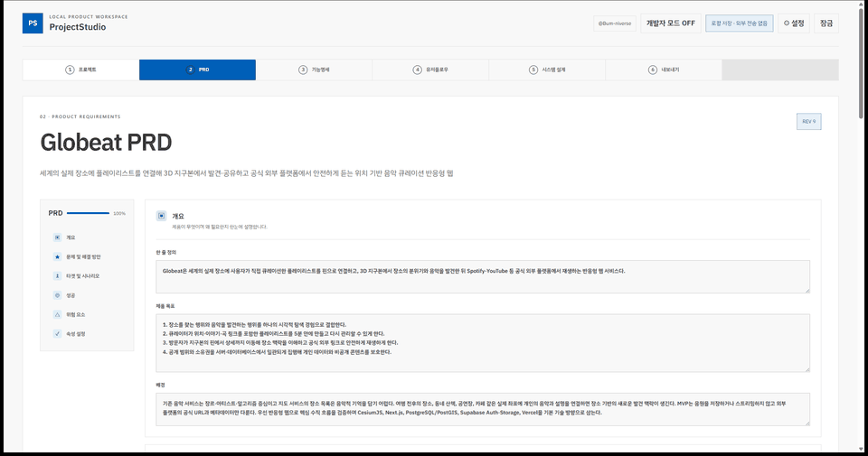
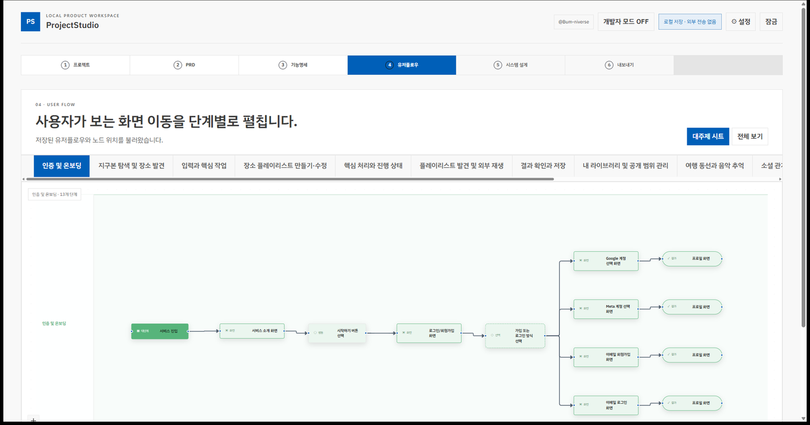
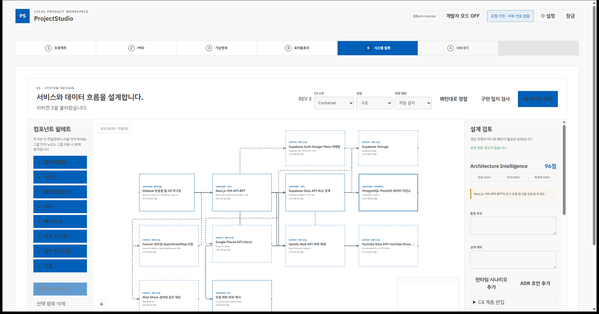
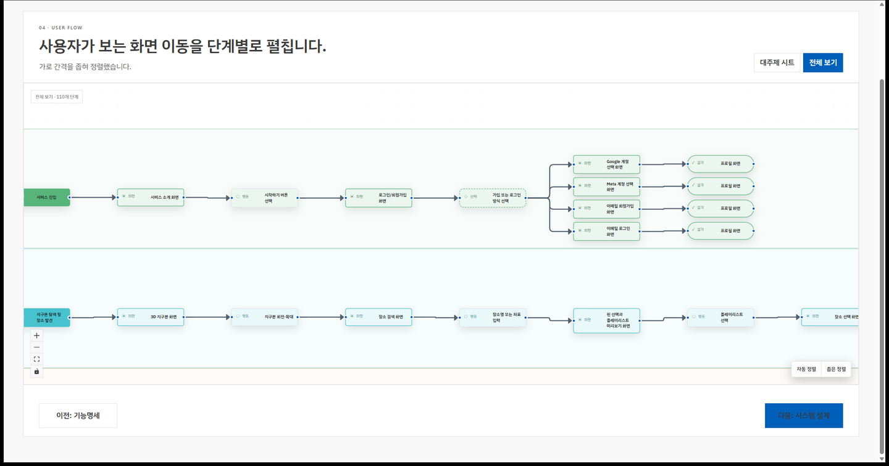

# ProjectStudio

[English](README.en.md)

개인 프로젝트의 아이디어를 PRD, 기능명세, 유저플로우 또는 실행 파이프라인, 시스템 설계로 발전시키고 실제 코드·커밋·테스트·완료 상태까지 추적하는 로컬 우선 데스크톱 프로그램입니다.

[Globeat 공개 데모 열기](https://bum-niverse.github.io/ProjectStudio/) · [최신 Windows 설치 파일](https://github.com/Bum-niverse/ProjectStudio/releases/latest)

공개 데모는 별도 설치나 로그인 없이 버튼만 눌러 Globeat의 PRD, 151개 기능명세, 트리·마인드맵, 110개 유저플로우 노드와 시스템 설계를 살펴볼 수 있습니다. 변경 사항은 현재 브라우저에만 남으며 `데모 초기화`로 원본 상태로 돌아갑니다.

앱을 열면 GitHub 로그인 잠금 화면이 먼저 표시됩니다. GitHub CLI로 인증된 사용자는 각자 자신의 Windows 계정에 저장된 로컬 작업대를 열 수 있으며 로그인 전에는 프로젝트 데이터베이스를 읽지 않습니다. 인증 토큰은 ProjectStudio가 저장하지 않고 GitHub CLI의 Windows keyring 세션을 사용합니다. `Bum-niverse` 소유자 계정에만 개발자 모드가 표시됩니다.



> 실제 ProjectStudio에 저장된 Globeat 샘플 작업공간으로 촬영한 데모입니다.

## 처음 시작하기

처음 설치하는 사용자는 [Windows 설치 및 사용 가이드](docs/getting-started.md)를 먼저 읽어 주세요. 설치 파일 확인, GitHub CLI 로그인, 선택적인 Codex CLI 연결과 첫 프로젝트 생성까지 순서대로 설명합니다.

### 3분 사용법

1. Windows 설치 파일을 설치하고 [GitHub CLI](https://cli.github.com/)로 로그인합니다.
2. 아이디어와 프로젝트 유형을 입력하면 ProjectStudio가 PRD 초안을 로컬 SQLite에 먼저 저장합니다.
3. 로컬에서 로그인된 Codex CLI가 있으면 `Codex로 상세 산출물 생성`을 누릅니다. ProjectStudio가 현재 PRD를 Codex에 구조화 입력으로 전달하고 기능 노드, 수용 기준, 유저플로우와 시스템 설계를 자동 생성합니다.
4. `문서 · 트리 · 마인드맵` 보기와 유저플로우 `전체 보기`에서 결과를 검토합니다. AI 변경안은 승인하기 전 원본에 반영되지 않습니다.
5. 구현할 저장소를 연결하고 Markdown·JSON·CSV·Mermaid·PDF로 내보내 Codex 또는 개발 도구에 넘깁니다.

화면 오른쪽 위에서 `한국어 / English`를 선택할 수 있습니다. 영어를 선택한 뒤 새로 실행하는 Codex 생성은 제목·설명·수용 기준까지 영어로 작성합니다. 이미 저장된 한국어 프로젝트 내용은 자동 번역하지 않습니다.

## 핵심 기능

### 1. 아이디어에서 검증 가능한 기획 산출물까지

프로젝트 유형과 아이디어를 입력하면 PRD를 시작으로 계층형 기능명세, 유저플로우 또는 실행 파이프라인, 시스템 설계까지 한 흐름에서 발전시킵니다. Codex CLI 생성 결과는 구조와 연결 무결성을 검사하며, AI 변경안은 사용자가 승인하기 전 원본에 반영하지 않습니다.

### 2. 요구사항과 사용자 흐름을 시각적으로 추적

기능을 문서·트리·마인드맵으로 전환하고, 사용자에게 보이는 화면과 행동만 스윔레인 유저플로우로 정리합니다. 시스템 설계에서는 C4 수준, 런타임 시나리오, ADR과 요구사항 연결을 하나의 캔버스에서 검토합니다.

### 3. 로컬 우선 개발 핸드오프

프로젝트와 모든 리비전을 로컬 SQLite에 저장하고 Git 브랜치·커밋·코드·테스트와 연결합니다. Markdown, JSON, CSV, Mermaid, PlantUML, Structurizr와 PDF로 내보내며, 프로젝트 내용과 인증 토큰을 ProjectStudio 서버에 저장하지 않습니다.

## 실제 화면

| 요구사항 기반 유저플로우 | 추적 가능한 시스템 설계 |
| --- | --- |
|  |  |

### 전체 유저플로우

`전체 보기`에서는 Globeat의 110개 사용자 단계를 여러 요구사항별 스윔레인으로 한 번에 탐색할 수 있습니다.



## 현재 단계

웹·모바일 프로젝트의 PRD·기능명세·유저플로우·시스템 설계·내보내기와 데이터 분석·머신러닝 프로젝트의 문제 정의·데이터 설계·실험 파이프라인·데이터/ML 시스템 설계·실행 계획 흐름을 로컬 SQLite 리비전으로 관리합니다. Pure Black·VS Code Light·Neutral Gray·VS Code Dark 테마, 로컬 Codex/Git/GitHub CLI 상태와 프로젝트별 Git 저장소 연결을 지원합니다. 현재 구현은 개인용 로컬 프로그램에 집중하며 결제와 다중 사용자 협업은 제외합니다.

최신 소스 버전은 **ProjectStudio 0.4.0 Beta**입니다. Globeat 공개 데모, 한국어·영어 선택, Codex 출력 언어 연동과 공개 배포 흐름이 포함됩니다.

새 프로젝트는 웹 서비스, 모바일 앱, 머신러닝, 데이터 분석 중 유형을 먼저 선택합니다. 선택값은 SQLite 프로젝트 원본에 저장되고 PRD·기능명세·작업 흐름·시스템 설계와 품질 검사의 기준이 됩니다. 웹·모바일 제품은 유저플로우를, 머신러닝·데이터 분석 프로젝트는 실행 파이프라인을 사용합니다. 백엔드 설계는 웹·모바일 기능명세와 시스템 설계에 필요한 구성요소로 포함합니다.

데이터 분석과 머신러닝은 세부 유형을 추가로 선택하고 `프로젝트 정의 → 문제·목표 정의 → 데이터/타깃 설계 → 분석/실험 설계 → 데이터 시스템/ML 파이프라인 설계 → 실행 계획·내보내기` 흐름을 사용합니다. 문제 정의서는 분석 질문·가설·성공 기준·제약과 ML 타깃/예측 시점 또는 분석 비교·검정 계약을 구분합니다. 데이터 설계에서는 데이터셋 출처·키·변수 사전·관계를 작성하고 N:N 병합, 누수 시점과 민감 데이터 정책을 검토하며 각 저장을 불변 SQLite revision으로 남깁니다. 상세 설계와 단계별 계약은 `docs/data-ml-project-workflow.md`에 정리되어 있습니다.

데이터 관계도, 세부 유형별 분석·실험 파이프라인, 데이터·ML 시스템 설계, 실행 작업 생성과 사용자 승인형 제안을 지원합니다. 내보내기는 canonical JSON과 검토용 Markdown을 기본으로 하고 데이터셋·변수·관계·실행 작업 CSV, Mermaid 관계도와 PDF 요약을 함께 생성할 수 있습니다. ProjectStudio는 실제 원본 데이터나 모델을 실행하지 않으며, 코드·테스트·산출물 링크와 schema·split·metric 계약 누락을 검토해 Codex가 다음 작업을 시작할 문맥을 만듭니다.

새 프로젝트는 로컬 규칙으로 PRD를 즉시 저장한 뒤, Codex CLI가 연결되어 있으면 해당 PRD와 프로젝트 유형을 구조화 입력으로 사용해 하위 산출물을 자동 생성합니다. 생성 결과는 최소 상세도와 ID·연결 무결성을 검사한 뒤 SQLite에 저장하며, CLI 오류가 발생해도 PRD는 유지됩니다.

- [MVP 아키텍처와 구현 계획](docs/mvp-architecture.md)
- [개발 진행](docs/progress.md)
- [포트폴리오 개발 기록](docs/portfolio-case-study.md)
- [제품 초안](docs/product-brief.md)
- [Codex 동기화 계약](docs/codex-sync-contract.md)
- [UI/UX 설계 및 검수 기준](docs/ui-ux-guidelines.md)
- [로컬 데이터와 개인정보](docs/privacy.md)
- [Windows 설치 및 사용 가이드](docs/getting-started.md)
- [Windows 베타 배포 및 업데이트](docs/distribution.md)
- [ProjectStudio Codex 스킬](.codex/skills/projectstudio-workspace/SKILL.md)

## 개발 명령

전체 로컬 검증은 `python scripts/validate.py`를 단일 진입점으로 사용합니다. 명령은 `.codex/validation-commands.json`에 저장되며 프론트 lint·test·build와 Rust fmt·test를 순서대로 실행합니다. 저장소 작업 절차와 보안·UI 검토 Skill은 `.agents/skills/`, 전체 정책은 `docs/agent-guidelines/`에 있습니다.

```bash
pnpm install
pnpm dev
pnpm test
pnpm lint
pnpm build
pnpm tauri dev
```

Windows에서는 `scripts/start_projectstudio.ps1 -Mode Auto`로 일반 앱을 열고, `-Mode Dev`로 실행하면 Vite HMR을 통해 프론트엔드 변경사항이 실행 중인 창에 실시간 반영됩니다.

브라우저 개발 미리보기는 메모리 저장소를 사용하고, Tauri 데스크톱 앱은 SQLite에 프로젝트와 PRD를 영속 저장합니다.

데스크톱 앱의 설정에서 로컬 Git 저장소를 지정한 뒤 `Codex 문서 동기화`를 실행하면 기능 문서와 변경 목록이 해당 저장소의 `.projectstudio` 폴더에 생성됩니다. API 키나 GitHub 토큰은 ProjectStudio에 저장하지 않습니다.

기능명세의 `AI 변경안`에서는 원본과 제안을 나란히 비교하고 승인 또는 거절할 수 있습니다. 승인 전에는 원본을 수정하지 않으며, 승인 시 기능명세와 수용 기준을 한 번에 반영하고 활동 기록을 남깁니다. 현재 제안 생성기는 외부 전송이 없는 로컬 개발 모드입니다.

3단계 기능명세 트리는 전체 구조와 대주제별 시트를 전환할 수 있습니다. `기본 정렬`은 대기능에서 화면·하위 기능·사용자 동작과 검증 규칙이 갈라지는 관계를 넓게 펼치고, `좁은 정렬`은 같은 구조를 압축합니다. 직교 곡선 연결선으로 한 부모에서 여러 자식으로 이어지는 계층을 추적합니다.

4단계 유저플로우는 기능명세를 그대로 펼치지 않습니다. 사용자에게 가치가 있는 요구사항만 가로 스윔레인으로 선별하고, 고정 레인 제목 옆에서 대단계 → 화면 → 사용자 행동 → 결과를 열 단위로 배치합니다. 회원가입 방식이나 음악 플랫폼처럼 사용자의 선택에 따라 다음 화면이 달라질 때만 여러 경로로 분기합니다. 광고·경제 정책 검토, 내부 RLS·데이터베이스·URL 안전 검증·캐시·토큰 처리는 기능명세 수용 기준이나 시스템 설계에 남깁니다.

와이어프레임 단계는 실제 기획 흐름에서 사용되지 않고 유저플로우·구현 작업과 역할이 겹쳐 2026-07-14에 제거했습니다. 기존 SQLite 마이그레이션 이력은 과거 작업공간 호환을 위해 유지하지만 제품 화면과 생성 흐름에서는 더 이상 읽거나 쓰지 않습니다.

Codex는 각 화면 블록의 캔버스 좌표와 크기까지 반환합니다. 결과 화면은 설명 카드가 아니라 헤더, 검색, 지도·이미지 자리, 지표 카드, 폼, 표·목록, 상세 패널과 버튼이 배치된 실제 저충실도 화면 구성으로 표시됩니다.

6단계 시스템 설계는 기능명세·유저플로우와 서비스·데이터베이스·외부 시스템·통신 구조를 연결하고 불변 JSON 리비전으로 저장합니다. 선택 단계라 바로 내보내기로 건너뛸 수 있습니다. 7단계 내보내기는 시스템 설계 JSON·Mermaid와 PDF 요약까지 함께 정리합니다. 자세한 계약은 [시스템 설계 문서](docs/system-design.md)를 참고하세요.

시스템 설계는 하나의 모델에서 C4 Context·Container·Component·Code 수준을 전환하며, 숨겨진 하위 요소를 통과하는 관계는 상위 수준의 간접 관계로 투영합니다. 런타임 관점에서는 호출 순서와 비동기 흐름을 구분합니다. 설정에 로컬 Git 저장소를 연결하면 노드의 코드·테스트 상대 경로를 읽기 전용으로 검사해 구현 일치, 경로 누락과 연결 없음 후보를 표시합니다.

설계 검토 패널은 품질 속성·제약, 런타임 시나리오, ADR, 리비전 차이, 요구사항 연결 후보와 구조 안티패턴을 한 모델에서 관리합니다. 노드별 구현·테스트·커밋·배포 상태와 연결 소스의 import/use 근거도 함께 추적합니다.

Rust 버전과 필수 컴포넌트는 `rust-toolchain.toml`에 고정되어 있습니다. Tauri 실행 시 SQLite 데이터베이스는 운영체제의 앱 데이터 디렉터리에 생성됩니다.

## 공개 Windows 베타

GitHub Releases에서 NSIS `.exe` 또는 MSI `.msi`를 누구나 내려받을 수 있습니다. 설치형 사용자는 Node.js, pnpm이나 Rust가 필요하지 않지만 GitHub 로그인 잠금을 사용하려면 [GitHub CLI](https://cli.github.com/) 설치와 로그인이 필요합니다. Codex·Claude·Antigravity·Ollama는 선택 기능이며 설치되어 있지 않아도 프로젝트, PRD, 기능명세, 유저플로우 또는 실행 파이프라인, 시스템 설계와 내보내기를 사용할 수 있습니다.

## 보안과 개인정보

- 프로젝트, PRD와 리비전은 사용자 PC의 SQLite에 저장되며 ProjectStudio 운영 서버로 업로드되지 않습니다.
- GitHub·Codex 토큰을 직접 저장하지 않고, 사용자가 각 CLI에서 이미 인증한 로컬 세션을 사용합니다.
- 공개 데모는 정적 빌드와 검토된 Globeat 예제 데이터만 포함합니다. 로컬 데이터베이스·사용자 경로·인증 정보·Tauri IPC에는 접근할 수 없습니다.
- Codex 생성 결과는 JSON Schema, ID 참조와 최소 상세도를 검사한 뒤 저장하고, 제안 변경은 사용자가 승인해야 반영됩니다.
- Windows 베타는 아직 코드 서명 인증서를 적용하지 않아 SmartScreen 경고가 표시될 수 있습니다. Release의 SHA-256 체크섬과 게시 저장소를 확인하세요.

상세 내용은 [개인정보 처리 경계](docs/privacy.md), [공개 데모 보안 감사](docs/security-audit-2026-07-30.md), [공개 배포 안내](docs/distribution.md)를 참고하세요.
